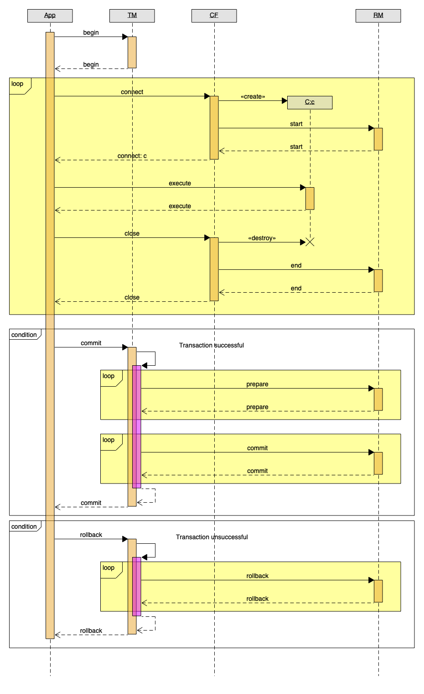

# Transaktionen

* [XA](https://pubs.opengroup.org/onlinepubs/009680699/toc.pdf)
* [JTA](https://download.oracle.com/otn-pub/jcp/jta-1_2-mrel2-spec/JTA1.2Specification.pdf?AuthParam=1638448785_b16e7edd7e2ecb73c219273a4980da3f)

* Narayana Bug: https://issues.redhat.com/browse/JBTM-3559

* Tranlog
    * Recovery Controller: https://github.com/snowdrop/narayana-spring-boot/tree/main/openshift/recovery-controller

