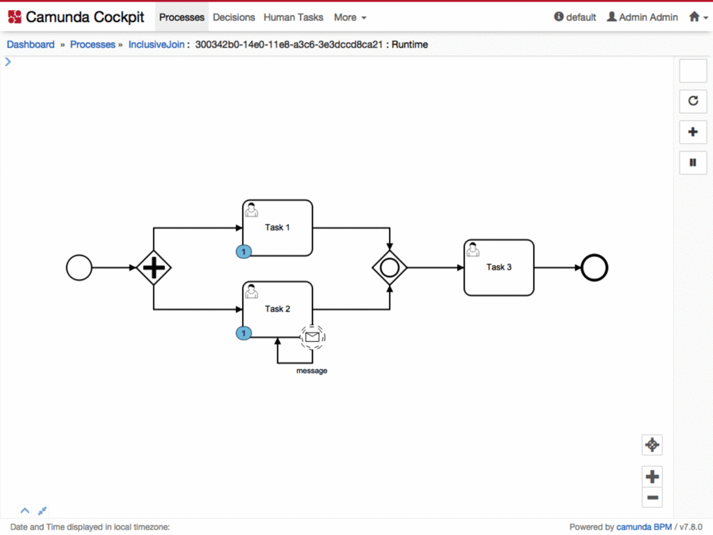
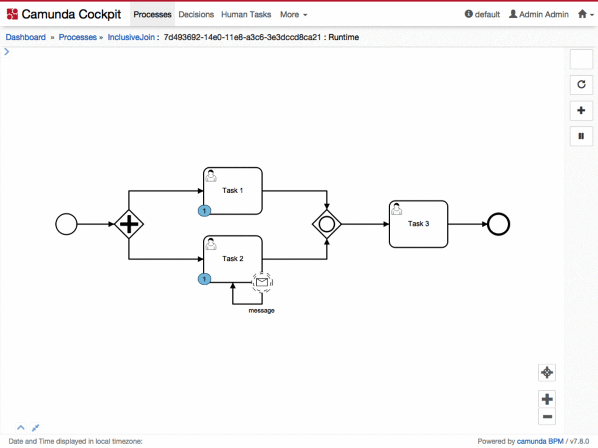

# BPMN 2.0 inclusive gateway join behaviour - specification vs. implementation

[Link](https://forum.camunda.org/t/bpmn-2-0-inclusive-gateway-join-behaviour-specification-vs-implementation/7345)

I’d like to initiate a discussion about the expected behaviour of the joining (incoming/converging) side of an inclusive gateway. I would like to know which behaviour was intended by the spec authors and how that (possibly) differs from the current implementation in camunda.

First I’d like to introduce what the spec says about the inclusive gateway:

> A converging Inclusive Gateway is used to merge a combination of alternative and parallel paths. A control flow token arriving at an Inclusive Gateway MAY be synchronized with some other tokens that arrive later at this Gateway. The precise synchronization behavior of the Inclusive Gateway can be found on page 292. (p. 292)

Thats pretty vague. I cannot find the referenced section on the "precise synchronization behavior of the Inclusive Gateway”. The next mention is in the chapter on execution semantics:

> The Inclusive Gateway synchronizes a certain subset of branches out of the set of concurrent incoming branches (merging behavior). (p. 436)

> The Inclusive Gateway is activated if
> * At least one incoming Sequence Flow has at least one token and
> * For every directed path formed by sequence flow that 
>   * starts with a Sequence Flow f of the diagram that has a token, 
>   * ends with an incoming Sequence Flow of the inclusive gateway that has no token, and 
>   * does not visit the Inclusive Gateway.
> * There is also a directed path formed by Sequence Flow that - starts with f,
>   * ends with an incoming Sequence Flow of the inclusive gateway that has a token, and 
>   * does not visit the Inclusive Gateway.
>
> Upon execution, a token is consumed from each incoming Sequence Flow that has a token. A token will be produced on some of the outgoing Sequence Flows. (p. 436)

Honestly, I do not fully understand this description. The phrase “does not visit” seems not to get properly introduced. I could interpret that "every directed path” includes multiple tokens per sequence flow, or not. I also don’t see the distinction between the second and third bullet point.

My conclusion from the spec is that there are two possible interpretations:

The simpler one: An inclusive gateway synchronises every token that is currently under way towards said gateway, but at most one per incoming sequence flow, i.e. waits for one token on every incoming sequence flow, as long one may still reach the gateway.
The more complex one (and potentially impossible to implement): An includes gateway synchronises every token that is currently under way towards said gateway. That would also include multiple tokens per sequence flow, which would make the gateway a global synchronisation point, as there is no distinction between tokens.
Maybe none of the above mentioned interpretations is the correct/intended one.
There was a similar discussion on an [IBM Forum](https://developer.ibm.com/answers/questions/202049/why-does-the-inclusive-gateway-not-merge-multiple/) which was concluded with an answer by Stephen A. White, a member of the core spec team:
“Inclusive merging in BPMN is the most complex situation within the formal execution semantics. It would (practically) impossible for the engine to look all the way upstream and determine the exact source of each token for all possible process configurations. Processes with many gateways, splitting and merging, and especially loops can create situations that are too complex to resolve the token identity accurately (or timely).

If there are two tokens arriving on a incoming sequence flow for an Inclusive Gateway, these two tokens could have been generated from the same split or by two successive splits - e.g., they represent the same merging instance or two separate merging instances.

Thus, when the formal execution semantics were defined in for the BPMN 2.0 specification, we took the approach of limiting the merging to only one token per incoming sequence flow (or none) for a single merging instance of the inclusive gateway. If another token is to arrive on one of the incoming sequence flows, that token is considered part a separate merging instance.

Simple modeling situations may be obvious as to how they should behave, but the formal definition of the merging had to take into account arbitrarily complex processes.“

That seem to match closely with my first interpretation, i.e. only one token per incoming sequence flow is merged per instance.

Quotes from the camunda BPMN 2.0 reference:

> all concurrent executions arriving at the inclusive gateway wait at the gateway until an execution has arrived for each of the incoming sequence flows that have a process token. This is an important difference to the parallel gateway. So in other words, the inclusive gateway will only wait for the incoming sequence flows that are executed. After the join, the process continues past the joining inclusive gateway. [Source](https://docs.camunda.org/manual/7.7/reference/bpmn20/gateways/inclusive-gateway/)

During my first steps with BPMN I modelled a process that pushed these limit. I might be able to solve that with a complex gateway, but those are not yet supported by camunda.

It is a simple process, with a single join. What makes it problematic is that there might (based on a message event) be more than one token on one of the incoming flows going into the join. See the two example runs:

A = simple execution, event not triggered: Task 2 completes, token waits at the join (as there is another token - in Task 1) coming towards it.

B = First the event triggers (creating a second token in Task 2), those two tokens are then forward (Task 2 completed twice), that satisfies the condition on the join (two arriving tokens) - which it shouldn’t.

This is - in my opinion - not a desired outcome, as the join did not really join two branches, but the same branch twice.

I’d expect a different behaviour, i.e. after the two instances of Task 2 are completed, those two tokens wait in the join (as there is another token coming from Task 1). If that token (from completing Task 1) arrives there are two possible outcomes:

1. all three tokens join and become one token in Task 3
2. the token from Task 1 and one of the tokens from Task 2 merge and become one token in Task 3, and the other “left over” token from Task 2 “merges” (as there is no other token currently under way). That would leave two tokens in Task 3.

The second possibility might seem similar to what actually happens, the outcome - two tokens in Task 3 - is the same. But it actually is not, because in my hypothetical (wanted) option 2 there was actually a join (wait) on the completion of Task 1 and Task 2 (and not just any two tasks), which might be what the business process modeller hat actually in mind.

I’d appreciate if anyone with an implementation background (e.g. camunda team) or spec background or any users, would join in on the discussion.
