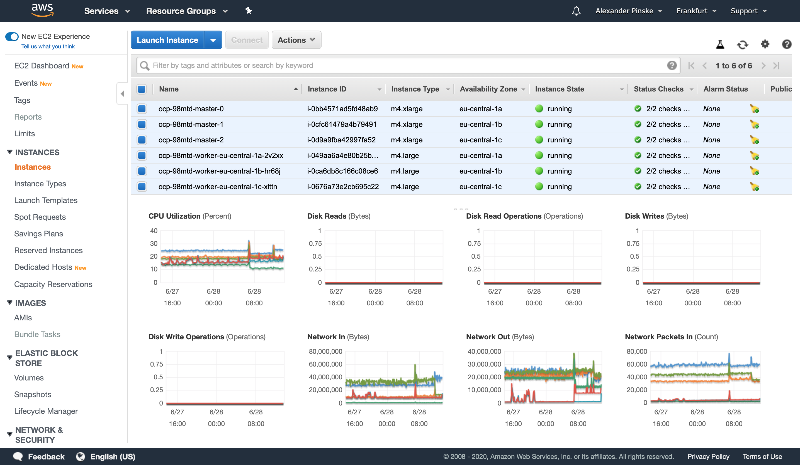
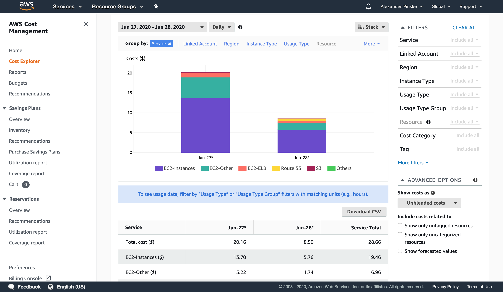
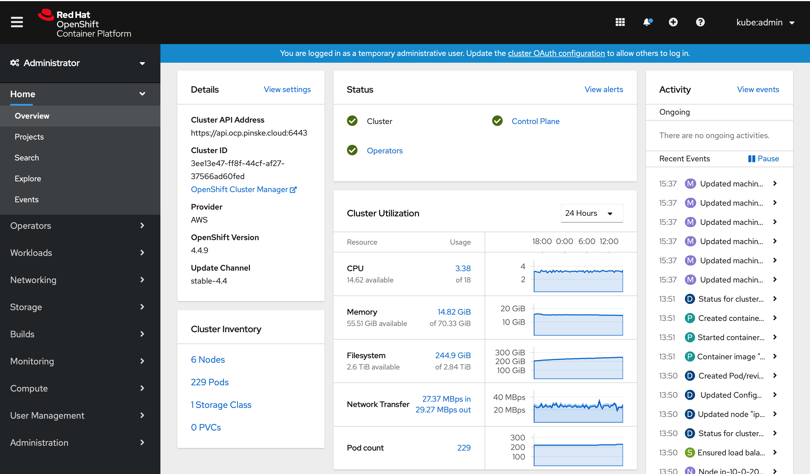

# OCP on AWS

I embarked on a little experiment this weekend. I wanted to try a piece of software that requires to run on OCP.
When the local installation (CodeReady Containers - CRC) turned my MacBook into a stove, I decided to give "the cloud" a try. 

So I setup the default OCP 4 cluster on AWS, following the [installation guide](https://docs.openshift.com/container-platform/4.4/installing/installing_aws/installing-aws-default.html).
The tooling is great and setup worked on first attempt.

The minimal config requires 3 master nodes (m4.xlarge) and at least 2 (default 3) worker nodes (m4.large). Yes, the internals need to be bigger than the actual runtime.

That setup costs about $30 a day plus all the small fees for DNS, load balancing, traffic, etc.

This empty default cluster uses loads of resources. The EC2 instances are paid for anyway, so why let it go to waste. 
4 CPU, 16GB RAM, 30MB/s traffic bidirectional for an idle cluster. Wow!

I hope I am doing something wrong and a well-setup idle cluster does indeed, well, idle.
